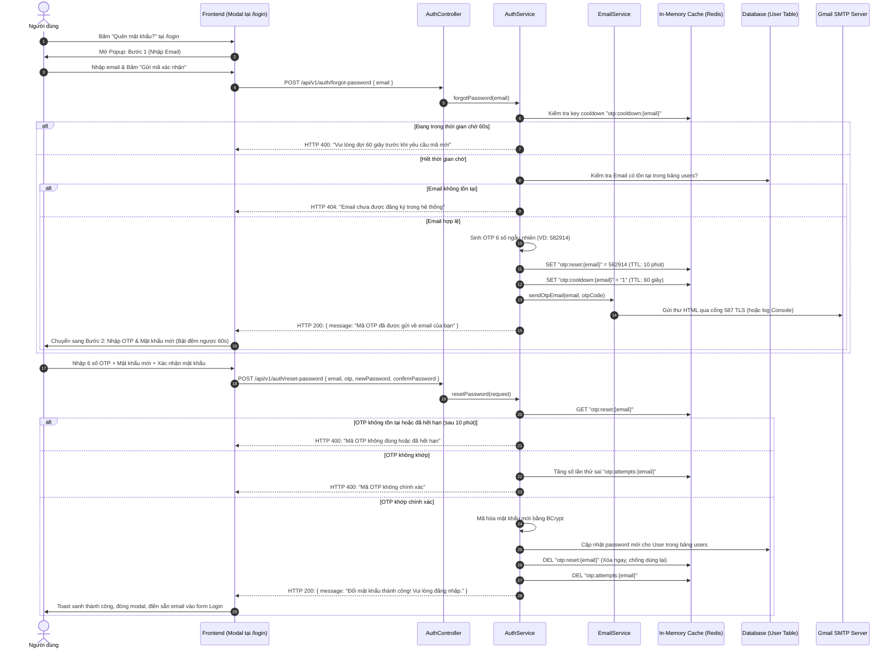

# 📋 KẾ HOẠCH TRIỂN KHAI TÍNH NĂNG QUÊN MẬT KHẨU QUA EMAIL OTP
*(Password Recovery System with Email OTP & Redis Cache)*

> **Phiên bản:** 2.0 (Kiến trúc Tối ưu hóa — Sử dụng Redis, không thêm Entity/Table)  
> **Cập nhật:** 18/09/2026  
> **Mục tiêu cốt lõi:** Khôi phục mật khẩu bảo mật, không làm phình cơ sở dữ liệu, tận dụng tối đa hạ tầng Redis có sẵn của Smart Recipe.

---

## 💡 I. BỐI CẢNH & NGUYÊN TẮC THIẾT KẾ KIẾN TRÚC

### 1. Tại sao KHÔNG tạo thêm Entity & Bảng Cơ sở dữ liệu?
* **Dữ liệu tạm thời (Ephemeral Data):** Mã OTP chỉ có vòng đời đúng **10 phút**. Nếu lưu vào MySQL/TiDB, bảng `password_reset_otp` sẽ nhanh chóng tích tụ hàng ngàn bản ghi rác hết hạn, đòi hỏi phải viết thêm Scheduler quét dọn định kỳ.
* **Bảo toàn Kiến trúc 18 Entity chuẩn mực:** Báo cáo Tốt nghiệp và sơ đồ CSDL của dự án đã chuẩn hóa 18 bảng. Việc giữ nguyên 18 Entity giúp dự án không bị phình to, giữ được tính gọn gàng và toàn vẹn của báo cáo.
* **Tận dụng Redis sẵn có:** Dự án đã có sẵn **Redis 7 (và Upstash Redis Cloud)**. Redis sinh ra là để xử lý dữ liệu có thời hạn (TTL), tự động hủy sau khi hết giờ mà không tốn một byte lưu trữ vĩnh viễn nào.

### 2. Yêu cầu Nghiệp vụ & Bảo mật
* **Bảo mật OTP:** Mã gồm 6 chữ số ngẫu nhiên (`SecureRandom`), hiệu lực **10 phút**, dùng duy nhất **1 lần** (Single-use).
* **Chống Brute-force:** Khóa OTP sau **5 lần** nhập sai liên tiếp.
* **Chống Spam (Rate Limit / Cooldown):** Mỗi email phải đợi tối thiểu **60 giây** mới được yêu cầu gửi lại mã (kèm đồng hồ đếm ngược trực quan trên giao diện).
* **Trải nghiệm Không gián đoạn (In-place Modal):** Thực hiện trực tiếp qua Modal Popup tại trang Đăng nhập (`/login`).
* **Email HTML Chuẩn Thương hiệu:** Mẫu thư mang bản sắc ẩm thực ấm áp (Warm Terracotta `#a13923`) của Smart Recipe.
* **Cơ chế An toàn (Local Fallback):** Tự động in mã OTP ra log console server nếu môi trường dev chưa gắn tài khoản Gmail, giúp lập trình viên kiểm thử trơn tru mọi lúc.

---

## 🔄 II. SƠ ĐỒ LUỒNG HOẠT ĐỘNG (SEQUENCE WORKFLOW)



---

## 🗄️ III. THIẾT KẾ BỘ NHỚ TẠM THỜI TRONG REDIS (0 ENTITY, 0 BẢNG MỚI)

Hệ thống quản lý 3 key Redis độc lập với cơ chế tự hủy (Self-expiring TTL):

| Redis Key Pattern | Kiểu dữ liệu | Giá trị lưu trữ | TTL (Thời gian sống) | Mục đích kỹ thuật |
|---|:---:|:---:|:---:|---|
| `otp:reset:{email}` | String | Mã OTP 6 chữ số (VD: `"719302"`) | **10 phút** (`600s`) | Lưu mã xác thực tạm thời. Hết 10 phút Redis tự xóa sạch. |
| `otp:cooldown:{email}` | String | `"1"` | **60 giây** (`60s`) | Chặn người dùng spam nút gửi mã liên tục. |
| `otp:attempts:{email}` | Integer | Số lần nhập sai (1 $\rightarrow$ 5) | **10 phút** (`600s`) | Chống Brute-force: nhập sai quá 5 lần sẽ vô hiệu hóa mã OTP. |

> [!TIP]
> **Ưu điểm kiến trúc:**
> - Cơ sở dữ liệu MySQL/TiDB giữ nguyên 18 bảng sạch sẽ, không có bất kỳ bảng rác nào.
> - Tốc độ kiểm tra OTP bằng micro-giây trực tiếp trên RAM.
> - Không cần viết tác vụ dọn dẹp định kỳ (`@Scheduled`).

---

## ⚙️ IV. CẤU HÌNH VÀ TẦNG DỊCH VỤ BACKEND

### 1. Thư viện trong `pom.xml`
Thêm starter mail của Spring Boot (dự án đã có sẵn `spring-boot-starter-data-redis`):
```xml
<dependency>
    <groupId>org.springframework.boot</groupId>
    <artifactId>spring-boot-starter-mail</artifactId>
</dependency>
```

### 2. Cấu hình `application.yaml`
```yaml
spring:
  mail:
    host: smtp.gmail.com
    port: 587
    username: ${SPRING_MAIL_USERNAME:smartrecipe.project@gmail.com}
    password: ${SPRING_MAIL_PASSWORD:}
    properties:
      mail:
        smtp:
          auth: true
          starttls:
            enable: true
            required: true
          connectiontimeout: 5000
          timeout: 5000
          writetimeout: 5000
```

### 3. Thiết kế DTO Request
* **`ForgotPasswordRequest.java`**:
  - `email`: `@NotBlank`, `@Email(message = "Email không hợp lệ")`.
* **`ResetPasswordRequest.java`**:
  - `email`: `@NotBlank`, `@Email`.
  - `otp`: `@NotBlank`, `@Size(min = 6, max = 6, message = "Mã OTP phải đúng 6 chữ số")`.
  - `newPassword`: `@NotBlank`, `@Size(min = 6, message = "Mật khẩu mới phải có tối thiểu 6 ký tự")`.
  - `confirmPassword`: `@NotBlank`.

### 4. Dịch vụ Gửi Email (`EmailService.java` & `EmailServiceImpl.java`)
* Soạn thảo email dạng HTML với phong cách **Warm Terracotta (`#a13923`)**:
  - Logo chiếc nĩa và muỗng đan chéo + Thương hiệu **Smart Recipe**.
  - Hộp hiển thị mã OTP to rõ nét (font `32px`, in đậm, nền `#fff1ea`, viền bo góc `#a13923`).
  - Lời nhắc an toàn: *"Mã xác thực có hiệu lực trong 10 phút. Tuyệt đối không chia sẻ mã này cho người khác."*
* **Cơ chế Dev Fallback thông minh:**
  - Kiểm tra nếu `mailSender` chưa có mật khẩu hoặc gặp lỗi kết nối Gmail $\rightarrow$ In thông báo nổi bật ra **Console Log**:
    ```
    ======================================================================
    [DEV OTP MOCK] Mã OTP đặt lại mật khẩu cho email admin@example.com là: 582914
    ======================================================================
    ```
  - Giúp việc phát triển và test tự động luôn chạy thông suốt ngay cả khi máy lập trình viên chưa cài đặt biến môi trường Gmail.

### 5. Cập nhật `AuthServiceImpl.java`
* Inject `StringRedisTemplate`, `PasswordEncoder`, `UserRepository`, `EmailService`.
* Triển khai hàm:
  - `void forgotPassword(ForgotPasswordRequest request)`
  - `void resetPassword(ResetPasswordRequest request)`

### 6. Cập nhật `AuthController.java` & `SecurityConfig.java`
* Endpoints mới:
  - `POST /api/v1/auth/forgot-password` (Public / `permitAll()`)
  - `POST /api/v1/auth/reset-password` (Public / `permitAll()`)

---

## 🎨 V. THIẾT KẾ GIAO DIỆN FRONTEND (REACT)

### 1. Cấu trúc Thành phần
* Component Modal: `smartrecipe-frontend/src/components/auth/ForgotPasswordModal.jsx`
* CSS Module: `smartrecipe-frontend/src/styles/components/auth/ForgotPasswordModal.module.css`

### 2. Giao diện 2 Bước Thông minh (Smart Step Flow)

#### 🔹 Bước 1: Nhập Email xác nhận
* Tiêu đề: **"Khôi phục mật khẩu"**
* Biểu tượng hòm thư ấm áp, ô nhập email có gợi ý định dạng.
* Nút **`[ Gửi mã xác nhận ]`**: khi bấm chuyển sang trạng thái xoay loading spinner, vô hiệu hóa nút để tránh click đúp.

#### 🔹 Bước 2: Nhập OTP & Mật khẩu mới
* Hiển thị dòng thông báo: *"Mã xác thực đã được gửi tới [email@domain.com]"*.
* Hộp nhập **6 chữ số OTP** (phông số to, giãn cách đều).
* Hai trường nhập **Mật khẩu mới** và **Xác nhận mật khẩu** (kèm icon con mắt `Eye` / `EyeOff` để ẩn/hiện mật khẩu).
* **Đồng hồ đếm ngược gửi lại:** *"Gửi lại mã sau (59s)"* $\rightarrow$ khi về 0s thì chuyển thành link *"Gửi lại mã OTP"*.
* Nút **`[ Xác nhận đổi mật khẩu ]`**.

### 3. Tích hợp tại `LoginPage.jsx`
* Gắn sự kiện `onClick={() => setIsForgotOpen(true)}` vào chữ *"Quên mật khẩu?"*.
* Khi đổi mật khẩu thành công:
  1. Đóng Modal.
  2. Bắn Toast xanh: *"Đổi mật khẩu thành công! Vui lòng đăng nhập bằng mật khẩu mới."*
  3. Tự động điền email vào ô đăng nhập để người dùng chỉ cần gõ mật khẩu mới là vào được ngay.

### 4. Bổ sung Service trong `authService.js`
```javascript
forgotPassword: async (email) => {
  const res = await api.post('/auth/forgot-password', { email });
  return res.data;
},
resetPassword: async (payload) => {
  const res = await api.post('/auth/reset-password', payload);
  return res.data;
},
```

---

## 🧪 VI. KỊCH BẢN KIỂM THỬ NGHIỆM THU (TESTING CHECKLIST)

### 1. Kiểm thử Tự động Backend (JUnit 5 + Mockito)
Tạo file test mới: `AuthServiceImplOtpTest.java`:
- [x] **Test 1:** Gọi `forgotPassword` với email chưa đăng ký $\rightarrow$ Ném ngoại lệ `ResourceNotFoundException`.
- [x] **Test 2:** Gọi `forgotPassword` lần thứ 2 khi chưa hết 60s cooldown $\rightarrow$ Ném ngoại lệ `BadRequestException`.
- [x] **Test 3:** Gọi `forgotPassword` hợp lệ $\rightarrow$ Lưu OTP vào Redis đúng 10 phút và gọi `EmailService.sendOtpEmail`.
- [x] **Test 4:** Gọi `resetPassword` với OTP đã hết hạn (Redis trả về `null`) $\rightarrow$ Ném ngoại lệ `BadRequestException`.
- [x] **Test 5:** Gọi `resetPassword` với OTP sai $\rightarrow$ Tăng biến attempts và ném ngoại lệ.
- [x] **Test 6:** Nhập sai quá 5 lần $\rightarrow$ Khóa OTP và ném ngoại lệ bảo vệ.
- [x] **Test 7:** Gọi `resetPassword` đúng OTP $\rightarrow$ Mã hóa BCrypt, cập nhật database, xóa ngay key OTP trong Redis (Single-use).

### 2. Kiểm thử Thực tế trên Giao diện Frontend
- [x] Nhập email không đúng cú pháp $\rightarrow$ Báo lỗi validation client.
- [x] Bấm gửi mã $\rightarrow$ Đồng hồ 60s đếm ngược chính xác, nút bị vô hiệu hóa trong 60s.
- [x] Nhập mật khẩu xác nhận không khớp $\rightarrow$ Báo lỗi đỏ ngay dưới ô nhập.
- [x] Đổi mật khẩu thành công $\rightarrow$ Đăng nhập trơn tru với mật khẩu mới.


---

## 🚀 VII. KẾT LUẬN & ĐÁNH GIÁ TỔNG THỂ
Kế hoạch này giúp dự án:
1. **Tinh gọn tuyệt đối:** 0 bảng mới, 0 Entity mới, dữ liệu sạch 100%.
2. **Chuẩn kỹ thuật thực tế:** Khai thác tối đa sức mạnh của Redis In-Memory Cache và TTL.
3. **Trải nghiệm người dùng:** Mượt mà, đẹp mắt, có đếm ngược cooldown và bảo vệ chống spam.
