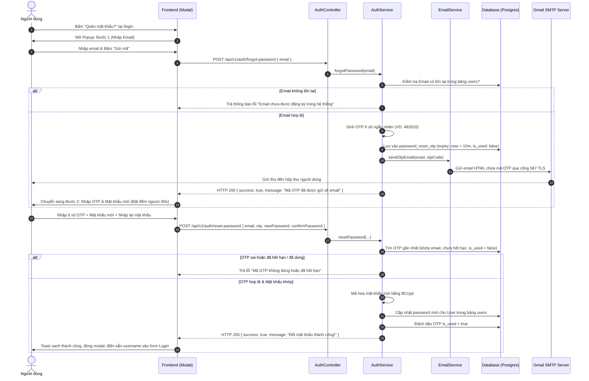

# KẾ HOẠCH TRIỂN KHAI TÍNH NĂNG QUÊN MẬT KHẨU QUA EMAIL OTP
*(Smart Recipe - Password Recovery System with Email OTP)*

---

## I. TỔNG QUAN VÀ MỤC TIÊU

### 1. Mục tiêu
Xây dựng trọn gói quy trình khôi phục mật khẩu an toàn, tiện lợi và tự động cho người dùng Smart Recipe khi quên mật khẩu đăng nhập, tích hợp dịch vụ gửi email thực tế qua Gmail SMTP và xác thực bằng mã OTP 6 chữ số có thời hạn.

### 2. Yêu cầu nghiệp vụ
* **Bảo mật:** Mã OTP gồm 6 chữ số ngẫu nhiên, chỉ có hiệu lực trong **10 phút** và chỉ được sử dụng duy nhất **1 lần** (Single-use).
* **Trải nghiệm người dùng (UX):** Thực hiện trực tiếp qua Modal Popup ngay trên trang Đăng nhập (`/login`), không bắt buộc chuyển trang gây gián đoạn.
* **Chống lạm dụng (Rate Limiting):** Giới hạn tối thiểu **60 giây** giữa hai lần yêu cầu gửi lại mã (có đồng hồ đếm ngược trực quan).
* **Mẫu Email chuyên nghiệp:** Gửi thư HTML mang bản sắc ẩm thực ấm áp (Warm Terracotta Branding) của Smart Recipe.

---

## II. LUỒNG HOẠT ĐỘNG CHI TIẾT (SEQUENCE WORKFLOW)



---

## III. THIẾT KẾ CƠ SỞ DỮ LIỆU (DATABASE SCHEMA)

### 1. Bảng mới: `password_reset_otp`
Tạo bảng lưu trữ các mã OTP phục vụ đặt lại mật khẩu:

```sql
CREATE TABLE password_reset_otp (
    id BIGSERIAL PRIMARY KEY,
    email VARCHAR(255) NOT NULL,
    otp_code VARCHAR(6) NOT NULL,
    expiry_time TIMESTAMP NOT NULL,
    is_used BOOLEAN DEFAULT FALSE,
    created_at TIMESTAMP DEFAULT CURRENT_TIMESTAMP
);

CREATE INDEX idx_password_reset_email ON password_reset_otp(email);
```

### 2. Entity Java: `PasswordResetOtp.java`
* Thư mục: `smartrecipe-backend/src/main/java/com/smartrecipe/smartrecipe_backend/entity/PasswordResetOtp.java`
* Các trường: `id`, `email`, `otpCode`, `expiryTime`, `isUsed`, `createdAt`.

### 3. Repository: `PasswordResetOtpRepository.java`
* Phương thức chính:
  * `Optional<PasswordResetOtp> findTopByEmailAndIsUsedFalseOrderByCreatedAtDesc(String email);`
  * `void deleteByExpiryTimeBefore(LocalDateTime now);` *(Dùng để quét dọn OTP cũ nếu cần)*

---

## IV. CẤU HÌNH DỊCH VỤ GỬI EMAIL (SPRING BOOT & GMAIL SMTP)

### 1. Thêm thư viện vào `pom.xml`
```xml
<dependency>
    <groupId>org.springframework.boot</groupId>
    <artifactId>spring-boot-starter-mail</artifactId>
</dependency>
```

### 2. Cấu hình `application.yml`
```yaml
spring:
  mail:
    host: smtp.gmail.com
    port: 587
    username: ${SPRING_MAIL_USERNAME:smartrecipe.project@gmail.com}
    password: ${SPRING_MAIL_PASSWORD:your-16-char-app-password}
    properties:
      mail:
        smtp:
          auth: true
          starttls:
            enable: true
            required: true
          connectiontimeout: 5000
          timeout: 5000
          writetimeout: 5000
```

> [!IMPORTANT]
> **Cách lấy Mật khẩu ứng dụng (App Password) của Gmail:**
> 1. Đăng nhập vào tài khoản Gmail dự án $\rightarrow$ chọn **Quản lý Tài khoản Google (Manage your Google Account)**.
> 2. Chọn mục **Bảo mật (Security)** $\rightarrow$ Bật **Xác minh 2 bước (2-Step Verification)** (nếu chưa bật).
> 3. Tìm kiếm mục **Mật khẩu ứng dụng (App Passwords)**.
> 4. Đặt tên ứng dụng là `SmartRecipe` $\rightarrow$ bấm **Tạo (Create)**.
> 5. Google sẽ cấp một chuỗi gồm **16 chữ cái** (ví dụ: `abcd efgh ijkl mnop`). Đây chính là giá trị dùng cho `SPRING_MAIL_PASSWORD`.

### 3. Thiết kế Mẫu Email HTML (`EmailService.java`)
Thư được định dạng HTML chỉn chu:
* Header: Logo chiếc nĩa và muỗng đan chéo + Thương hiệu **Smart Recipe - Smart Cooking**.
* Body:
  * Lời chào người dùng.
  * Hộp hiển thị mã OTP to rõ nét (kích thước `32px`, font in đậm, nền `#fff1ea`, viền `#a13923`).
  * Lời nhắc: *"Mã xác thực này có hiệu lực trong vòng 10 phút. Tuyệt đối không chia sẻ mã này cho bất kỳ ai."*
* Footer: Lời cảm ơn và thông tin hỗ trợ từ đội ngũ Smart Recipe.

---

## V. CHI TIẾT CÁC API BACKEND

### 1. DTO Request

#### a) `ForgotPasswordRequest.java`
```java
@Data
public class ForgotPasswordRequest {
    @NotBlank(message = "Email không được để trống")
    @Email(message = "Email không đúng định dạng")
    private String email;
}
```

#### b) `ResetPasswordRequest.java`
```java
@Data
public class ResetPasswordRequest {
    @NotBlank(message = "Email không được để trống")
    @Email(message = "Email không hợp lệ")
    private String email;

    @NotBlank(message = "Mã OTP không được để trống")
    @Size(min = 6, max = 6, message = "Mã OTP phải gồm 6 chữ số")
    private String otp;

    @NotBlank(message = "Mật khẩu mới không được để trống")
    @Size(min = 6, message = "Mật khẩu mới phải có ít nhất 6 ký tự")
    private String newPassword;

    @NotBlank(message = "Xác nhận mật khẩu không được để trống")
    private String confirmPassword;
}
```

### 2. Endpoints trong `AuthController.java`

| Phương thức | Endpoint | Chức năng | Phân quyền |
| :--- | :--- | :--- | :--- |
| `POST` | `/api/v1/auth/forgot-password` | Kiểm tra email, sinh OTP và gửi mail | `permitAll()` |
| `POST` | `/api/v1/auth/reset-password` | Kiểm tra OTP, mã hóa và cập nhật mật khẩu mới | `permitAll()` |

### 3. Phân quyền trong `SecurityConfig.java`
```java
.requestMatchers("/api/v1/auth/forgot-password", "/api/v1/auth/reset-password").permitAll()
```

---

## VI. THIẾT KẾ GIAO DIỆN FRONTEND (REACT)

### 1. Cấu trúc Component
* `smartrecipe-frontend/src/components/auth/ForgotPasswordModal.jsx`
* `smartrecipe-frontend/src/components/auth/ForgotPasswordModal.module.css`

### 2. Hai trạng thái của Modal
* **Bước 1 (Gửi yêu cầu):**
  * Tiêu đề: **"Khôi phục mật khẩu"**
  * Mô tả: *"Nhập email liên kết với tài khoản của bạn để nhận mã xác thực OTP."*
  * Ô nhập Email kèm icon hòm thư `Mail`.
  * Nút `[Gửi mã xác nhận]` (có icon xoay loading khi đang gọi API gửi mail).
* **Bước 2 (Xác thực & Đặt lại mật khẩu):**
  * Hiển thị thông báo: *"Mã OTP đã được gửi đến [email@example.com]"*.
  * Ô nhập 6 số OTP (hoặc 6 ô vuông tự động nhảy con trỏ).
  * Ô nhập Mật khẩu mới + Ô Xác nhận mật khẩu mới (kèm nút ẩn/hiện mật khẩu).
  * Bộ đếm ngược gửi lại mã: *"Gửi lại mã sau (59s)"*.
  * Nút `[Xác nhận đổi mật khẩu]`.

### 3. Tích hợp vào `LoginPage.jsx`
* Gắn sự kiện `onClick={() => setIsForgotModalOpen(true)}` vào nút `Quên mật khẩu?`.
* Sau khi đổi mật khẩu thành công:
  * Đóng modal.
  * Bắn Toast thông báo: *"Đổi mật khẩu thành công! Vui lòng đăng nhập với mật khẩu mới."*
  * Tự động điền email/username vào ô đăng nhập để người dùng chỉ việc gõ mật khẩu mới vào.

### 4. Bổ sung Service trong `authService.js`
```javascript
forgotPassword: async (email) => {
  const res = await api.post('/auth/forgot-password', { email });
  return res.data;
},
resetPassword: async (data) => {
  const res = await api.post('/auth/reset-password', data);
  return res.data;
}
```

---

## VII. KỊCH BẢN KIỂM THỬ (TESTING & VERIFICATION CHECKLIST)

- [ ] **Test Case 1:** Nhập email không tồn tại trong hệ thống $\rightarrow$ Hiển thị lỗi rõ ràng, không làm crash server.
- [ ] **Test Case 2:** Nhập email hợp lệ $\rightarrow$ Kiểm tra hộp thư Gmail thực tế xem có nhận được thư HTML và mã OTP 6 số không.
- [ ] **Test Case 3:** Nhập sai mã OTP $\rightarrow$ Hệ thống từ chối và báo *"Mã OTP không chính xác"*.
- [ ] **Test Case 4:** Nhập mã OTP đã hết hạn (> 10 phút) $\rightarrow$ Hệ thống từ chối và báo *"Mã OTP đã hết hạn hiệu lực"*.
- [ ] **Test Case 5:** Nhập mật khẩu xác nhận không khớp mật khẩu mới $\rightarrow$ Báo lỗi validation ngay tại frontend.
- [ ] **Test Case 6:** Nhập đúng OTP và mật khẩu mới $\rightarrow$ Đổi thành công $\rightarrow$ Thử đăng nhập lại bằng mật khẩu mới.
- [ ] **Test Case 7:** Thử dùng lại mã OTP vừa đổi để đổi tiếp lần 2 $\rightarrow$ Bị từ chối vì `is_used = true`.
- [ ] **Test Case 8:** Nhấn nút gửi lại mã khi chưa hết 60 giây $\rightarrow$ Bị chặn rate limit.

---

## VIII. LỘ TRÌNH THỰC HIỆN DỰ KIẾN
* **Thời gian hoàn thành:** ~45 phút làm việc liền mạch.
* **Thứ tự ưu tiên:** Triển khai ngay sau khi kết thúc các công việc của **Giai đoạn 5 (Sprint 6)**.
