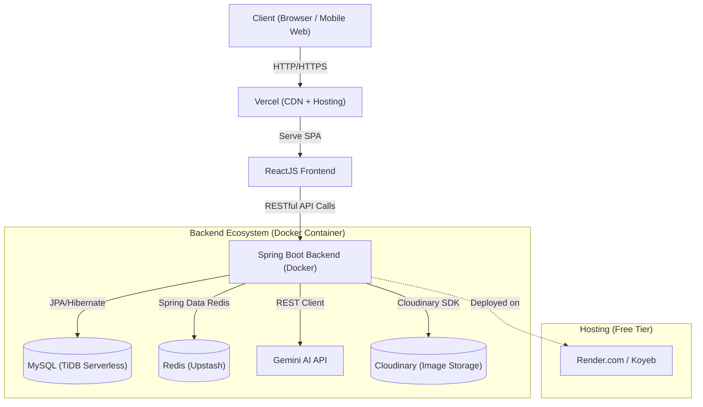
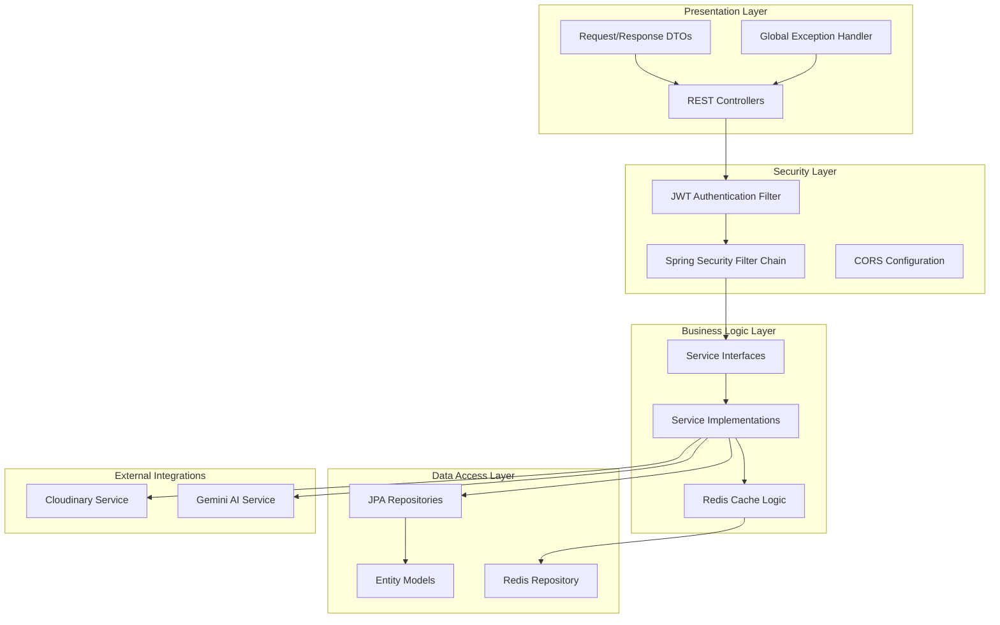
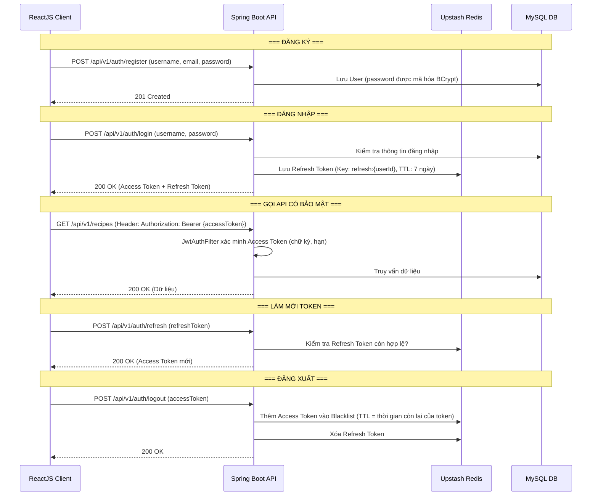
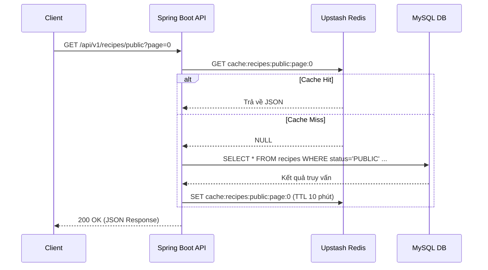
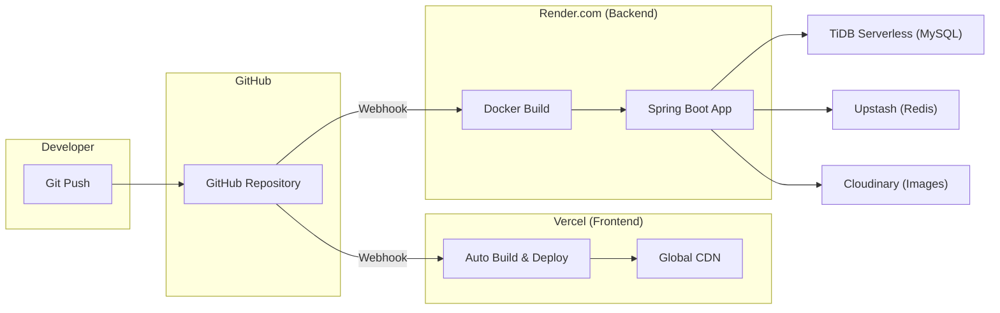

# Kiến trúc Hệ thống Web Fullstack (ReactJS & Spring Boot) & Cơ chế Redis

Tài liệu này mô tả thiết kế kiến trúc tổng thể cho dự án **Smart Recipe & Grocery Platform** theo mô hình RESTful API, sử dụng ReactJS cho Frontend, Java Spring Boot cho Backend, cơ sở dữ liệu quan hệ (MySQL) và Redis để tối ưu hóa hiệu suất.

---

## 1. Tổng quan Kiến trúc Hệ thống (System Architecture)

Mô hình hệ thống tuân theo kiến trúc **Client-Server** giao tiếp hoàn toàn qua **RESTful API** với giao thức HTTP/HTTPS.



---

## 2. Thiết kế Kiến trúc Backend (Java Spring Boot)

Backend được xây dựng theo kiến trúc **N-Tier (Đa tầng)** chuẩn mực của Spring Boot, đảm bảo tính tách biệt trách nhiệm (Separation of Concerns), dễ bảo trì và mở rộng.

### 2.1. Sơ đồ Kiến trúc Phân tầng



### 2.2. Mô tả Chi tiết Từng Tầng

| Tầng (Layer) | Trách nhiệm | Package |
|---|---|---|
| **Controller** | Tiếp nhận HTTP requests, validate đầu vào (Bean Validation), trả về Response DTO | `controller` |
| **DTO** | Chuyển đổi dữ liệu giữa Entity (DB) và JSON (Client), tránh rò rỉ dữ liệu nhạy cảm | `dto.request`, `dto.response` |
| **Service** | Chứa toàn bộ business logic (thuật toán gộp nguyên liệu, tính dinh dưỡng, đối chiếu tủ lạnh) | `service` |
| **Repository** | Giao tiếp với cơ sở dữ liệu qua Spring Data JPA | `repository` |
| **Entity** | Ánh xạ trực tiếp với các bảng trong CSDL | `entity` |
| **Security** | JWT Filter, Authentication Provider, CORS, SecurityFilterChain | `security` |
| **Config** | Cấu hình Redis, Cloudinary, Swagger/OpenAPI, WebMvc | `config` |
| **Exception** | Xử lý lỗi tập trung (GlobalExceptionHandler, custom exceptions) | `exception` |

### 2.3. Cấu trúc Thư mục Backend

```
smart-recipe-backend/
├── src/main/java/com/smartrecipe/
│   ├── SmartRecipeApplication.java
│   ├── config/
│   │   ├── RedisConfig.java
│   │   ├── CloudinaryConfig.java
│   │   ├── SwaggerConfig.java
│   │   └── WebMvcConfig.java
│   ├── security/
│   │   ├── JwtAuthFilter.java
│   │   ├── JwtProvider.java
│   │   ├── SecurityConfig.java
│   │   └── UserDetailsServiceImpl.java
│   ├── controller/
│   │   ├── AuthController.java
│   │   ├── UserController.java
│   │   ├── RecipeController.java
│   │   ├── IngredientController.java
│   │   ├── PantryController.java
│   │   ├── GroceryController.java
│   │   ├── CookingJournalController.java
│   │   ├── AiSuggestionController.java
│   │   └── CommunityController.java
│   ├── service/
│   │   ├── AuthService.java
│   │   ├── UserService.java
│   │   ├── RecipeService.java
│   │   ├── IngredientService.java
│   │   ├── PantryService.java
│   │   ├── GroceryService.java
│   │   ├── CookingJournalService.java
│   │   ├── AiSuggestionService.java
│   │   ├── CloudinaryService.java
│   │   └── RedisService.java
│   ├── repository/
│   │   ├── UserRepository.java
│   │   ├── RecipeRepository.java
│   │   ├── IngredientRepository.java
│   │   └── ...
│   ├── entity/
│   │   ├── User.java
│   │   ├── Recipe.java
│   │   ├── Ingredient.java
│   │   └── ...
│   ├── dto/
│   │   ├── request/
│   │   │   ├── LoginRequest.java
│   │   │   ├── RegisterRequest.java
│   │   │   ├── RecipeRequest.java
│   │   │   └── ...
│   │   └── response/
│   │       ├── AuthResponse.java
│   │       ├── RecipeResponse.java
│   │       ├── ApiResponse.java
│   │       └── ...
│   └── exception/
│       ├── GlobalExceptionHandler.java
│       ├── ResourceNotFoundException.java
│       └── UnauthorizedException.java
├── src/main/resources/
│   ├── application.yml
│   └── application-dev.yml
├── Dockerfile
├── docker-compose.yml
└── pom.xml
```

### 2.4. Luồng Xác thực JWT (Authentication Flow)



---

## 3. Thiết kế RESTful API Endpoints

Tất cả API đều tuân theo tiền tố (base path): `/api/v1`

### 3.1. Xác thực & Người dùng (Auth & Users)

| Method | Endpoint | Mô tả | Auth |
|--------|----------|--------|------|
| `POST` | `/auth/register` | Đăng ký tài khoản mới | ❌ |
| `POST` | `/auth/login` | Đăng nhập, trả về JWT Token | ❌ |
| `POST` | `/auth/refresh` | Làm mới Access Token | ❌ |
| `POST` | `/auth/logout` | Đăng xuất, thu hồi Token | ✅ |
| `GET` | `/users/me` | Lấy thông tin cá nhân | ✅ |
| `PUT` | `/users/me` | Cập nhật hồ sơ cá nhân | ✅ |
| `POST` | `/users/me/avatar` | Upload ảnh đại diện (Cloudinary) | ✅ |
| `GET` | `/users/{id}` | Xem hồ sơ người dùng khác | ✅ |

### 3.2. Quản lý Công thức (Recipes)

| Method | Endpoint | Mô tả | Auth |
|--------|----------|--------|------|
| `POST` | `/recipes` | Tạo công thức mới | ✅ |
| `GET` | `/recipes/{id}` | Xem chi tiết công thức | ✅ |
| `PUT` | `/recipes/{id}` | Cập nhật công thức (chủ sở hữu) | ✅ |
| `DELETE` | `/recipes/{id}` | Xóa công thức (chủ sở hữu) | ✅ |
| `GET` | `/recipes/my` | Danh sách công thức cá nhân | ✅ |
| `GET` | `/recipes/public` | Danh sách công thức cộng đồng (Feed) | ✅ |
| `GET` | `/recipes/search?q=&tags=&difficulty=` | Tìm kiếm và lọc công thức | ✅ |
| `POST` | `/recipes/{id}/clone` | Sao chép công thức cộng đồng về cá nhân | ✅ |
| `POST` | `/recipes/{id}/image` | Upload ảnh công thức (Cloudinary) | ✅ |

### 3.3. Nguyên liệu & Dữ liệu từ điển (Ingredients & Master Data)

| Method | Endpoint | Mô tả | Auth |
|--------|----------|--------|------|
| `GET` | `/ingredients` | Danh sách tất cả nguyên liệu (có phân trang) | ✅ |
| `GET` | `/ingredients/search?q=` | Tìm kiếm nguyên liệu (Autocomplete từ Redis) | ✅ |
| `POST` | `/ingredients` | Thêm nguyên liệu mới | ✅ ADMIN |
| `GET` | `/aisles` | Danh sách quầy hàng | ✅ |
| `GET` | `/tags` | Danh sách tất cả thẻ phân loại | ✅ |
| `GET` | `/unit-conversions` | Bảng quy đổi đơn vị | ✅ |

### 3.4. Tủ lạnh (Pantry)

| Method | Endpoint | Mô tả | Auth |
|--------|----------|--------|------|
| `GET` | `/pantry` | Xem tủ lạnh của tôi | ✅ |
| `POST` | `/pantry` | Thêm nguyên liệu vào tủ lạnh | ✅ |
| `PUT` | `/pantry/{id}` | Cập nhật số lượng nguyên liệu | ✅ |
| `DELETE` | `/pantry/{id}` | Xóa nguyên liệu khỏi tủ lạnh | ✅ |
| `GET` | `/pantry/low-stock` | Danh sách nguyên liệu sắp hết | ✅ |

### 3.5. Đi chợ (Grocery)

| Method | Endpoint | Mô tả | Auth |
|--------|----------|--------|------|
| `POST` | `/grocery-lists` | Tạo phiên đi chợ mới (gắn công thức + số khẩu phần) | ✅ |
| `GET` | `/grocery-lists` | Danh sách các phiên đi chợ | ✅ |
| `GET` | `/grocery-lists/{id}` | Chi tiết phiên đi chợ (bao gồm danh sách cần mua) | ✅ |
| `PATCH` | `/grocery-lists/{id}/complete` | Đánh dấu hoàn tất đi chợ | ✅ |
| `PATCH` | `/grocery-items/{id}/toggle` | Check/Uncheck đã mua nguyên liệu | ✅ |

### 3.6. Nhật ký Nấu ăn (Cooking Journals)

| Method | Endpoint | Mô tả | Auth |
|--------|----------|--------|------|
| `POST` | `/cooking-journals` | Ghi nhật ký nấu ăn (trigger trừ kho tủ lạnh) | ✅ |
| `GET` | `/cooking-journals` | Lịch sử nấu ăn của tôi | ✅ |
| `GET` | `/cooking-journals/{id}` | Chi tiết nhật ký | ✅ |
| `PUT` | `/cooking-journals/{id}` | Cập nhật ghi chú / đánh giá | ✅ |

### 3.7. Trợ lý AI (AI Suggestions)

| Method | Endpoint | Mô tả | Auth |
|--------|----------|--------|------|
| `POST` | `/ai/suggest` | Gợi ý món ăn từ nguyên liệu (Gemini API, cache Redis) | ✅ |
| `GET` | `/ai/history` | Lịch sử các lần gợi ý AI | ✅ |
| `POST` | `/ai/{logId}/save` | Lưu gợi ý AI thành công thức cá nhân | ✅ |

### 3.8. Cộng đồng (Community Interactions)

| Method | Endpoint | Mô tả | Auth |
|--------|----------|--------|------|
| `POST` | `/recipes/{id}/like` | Thả tim / Bỏ thả tim công thức | ✅ |
| `GET` | `/recipes/{id}/comments` | Danh sách bình luận của công thức | ✅ |
| `POST` | `/recipes/{id}/comments` | Đăng bình luận | ✅ |
| `PUT` | `/comments/{id}` | Chỉnh sửa bình luận (chủ sở hữu) | ✅ |
| `DELETE` | `/comments/{id}` | Xóa bình luận (chủ sở hữu hoặc ADMIN) | ✅ |

### 3.9. Định dạng Response chuẩn

Tất cả API sẽ trả về theo cấu trúc JSON thống nhất:

```json
// Thành công
{
  "success": true,
  "message": "Lấy danh sách công thức thành công",
  "data": { ... },
  "timestamp": "2026-07-30T16:00:00Z"
}

// Thành công có phân trang
{
  "success": true,
  "data": {
    "content": [ ... ],
    "page": 0,
    "size": 10,
    "totalElements": 150,
    "totalPages": 15
  }
}

// Lỗi
{
  "success": false,
  "message": "Không tìm thấy công thức",
  "errorCode": "RECIPE_NOT_FOUND",
  "timestamp": "2026-07-30T16:00:00Z"
}
```

---

## 4. Thiết kế Kiến trúc Frontend (ReactJS)

### 4.1. Công nghệ Sử dụng

| Vai trò | Công nghệ | Lý do |
|---------|-----------|-------|
| Build Tool | **Vite** | Tốc độ build và HMR (Hot Module Replacement) cực nhanh |
| UI Framework | **TailwindCSS** hoặc **Material-UI** | Linh hoạt, hệ sinh thái component đồ sộ |
| Routing | **React Router DOM v6** | Tiêu chuẩn cho SPA, hỗ trợ Lazy Loading |
| Server State | **TanStack Query (React Query)** | Caching API response trên client, tự động re-fetch |
| Client State | **Zustand** | Nhẹ, đơn giản hơn Redux cho dự án vừa |
| HTTP Client | **Axios** | Interceptors cho JWT, xử lý lỗi tập trung |
| Form | **React Hook Form + Zod** | Validation mạnh mẽ, hiệu suất cao |

### 4.2. Cấu trúc Thư mục Frontend

```
smart-recipe-frontend/
├── public/
├── src/
│   ├── assets/           # Hình ảnh, icons tĩnh
│   ├── components/       # Components tái sử dụng
│   │   ├── ui/           # Button, Input, Modal, Card...
│   │   ├── layout/       # Header, Footer, Sidebar
│   │   └── recipe/       # RecipeCard, RecipeList, StepEditor...
│   ├── pages/            # Các trang chính
│   │   ├── HomePage.jsx
│   │   ├── LoginPage.jsx
│   │   ├── RegisterPage.jsx
│   │   ├── RecipeDetailPage.jsx
│   │   ├── MyRecipesPage.jsx
│   │   ├── CommunityFeedPage.jsx
│   │   ├── PantryPage.jsx
│   │   ├── GroceryPage.jsx
│   │   ├── CookingJournalPage.jsx
│   │   ├── AiSuggestionPage.jsx
│   │   └── ProfilePage.jsx
│   ├── services/         # Axios API calls
│   │   ├── api.js        # Axios instance + interceptors
│   │   ├── authService.js
│   │   ├── recipeService.js
│   │   ├── pantryService.js
│   │   └── ...
│   ├── hooks/            # Custom React Hooks
│   │   ├── useAuth.js
│   │   ├── useRecipes.js
│   │   └── ...
│   ├── store/            # Zustand stores
│   │   ├── authStore.js
│   │   └── groceryStore.js
│   ├── utils/            # Helper functions
│   ├── App.jsx
│   ├── main.jsx
│   └── index.css
├── .env
├── vite.config.js
└── package.json
```

---

## 5. Thiết kế Cơ chế Lưu trữ Tốc độ cao bằng Redis

Redis sẽ được sử dụng làm In-memory Data Store để giải quyết bài toán hiệu suất, giảm tải cho Database và tiết kiệm chi phí gọi API bên thứ 3 (Gemini).

### 5.1. Các kịch bản ứng dụng Redis (Use cases)

1.  **Caching Master Data (Dữ liệu từ điển):**
    *   **Dữ liệu:** Các bảng `ingredients`, `aisles`, `tags`, `unit_conversions`.
    *   **Chiến lược:** Load vào Redis khi hệ thống khởi động. Xóa/cập nhật cache (Cache Invalidation) khi Admin có thao tác thêm/sửa/xóa.
    *   **Lợi ích:** Autocomplete khi gõ tên nguyên liệu sẽ lấy từ Redis, tốc độ < 10ms.
2.  **Caching API Phổ biến (Top công thức Public, Feed cộng đồng):**
    *   **Chiến lược:** Caching với TTL ngắn, khoảng 5-15 phút.
3.  **Caching Kết quả AI (Gemini AI Suggestions):**
    *   **Cơ chế:** Hash mảng nguyên liệu đầu vào làm Key. Kiểm tra Redis trước, nếu cache miss mới gọi Gemini API, lưu kết quả (TTL ~24h).
4.  **Quản lý Session & Authentication (Token Blacklist & Refresh Token).**
5.  **Rate Limiting (Giới hạn request):** Đếm số request/phút của mỗi `user_id`.

### 5.2. Bảng Thiết kế Redis Key chi tiết

| Key Pattern | Value Type | TTL | Mô tả |
|---|---|---|---|
| `auth:refresh:{userId}` | String (token) | 7 ngày | Refresh Token của người dùng |
| `auth:blacklist:{jti}` | String ("revoked") | Bằng thời gian còn lại của token | JWT đã bị thu hồi (đăng xuất) |
| `cache:ingredients:all` | JSON (List) | Không hết hạn* | Danh sách tất cả nguyên liệu |
| `cache:aisles:all` | JSON (List) | Không hết hạn* | Danh sách quầy hàng |
| `cache:tags:all` | JSON (List) | Không hết hạn* | Danh sách thẻ phân loại |
| `cache:unit_conversions:all` | JSON (List) | Không hết hạn* | Bảng quy đổi đơn vị |
| `cache:recipes:public:page:{n}` | JSON (Page) | 10 phút | Danh sách feed cộng đồng (theo trang) |
| `cache:recipes:popular` | JSON (List) | 15 phút | Top công thức phổ biến nhất |
| `cache:recipe:{recipeId}` | JSON (Object) | 30 phút | Chi tiết 1 công thức (cache hot data) |
| `ai:suggest:{inputHash}` | JSON (Object) | 24 giờ | Kết quả gợi ý AI theo bộ nguyên liệu |
| `ratelimit:ai:{userId}` | Counter (INT) | 1 giờ | Đếm số lần gọi AI của user (giới hạn 10 lần/giờ) |

> \* Không hết hạn nhưng sẽ bị xóa thủ công khi Admin thay đổi dữ liệu (Cache Invalidation).

### 5.3. Luồng hoạt động Cache-Aside Pattern



---

## 6. Phân bổ Hạ tầng Triển khai (Infrastructure & Deployment) – Miễn phí

| Thành phần | Nền tảng | Gói miễn phí |
|---|---|---|
| **Frontend** (ReactJS SPA) | **Vercel** | Unlimited bandwidth, auto CI/CD từ GitHub, SSL miễn phí, CDN toàn cầu |
| **Backend** (Spring Boot) | **Render.com** hoặc **Koyeb** | Chạy Docker container miễn phí (lưu ý: Render free sẽ sleep sau 15 phút không có request) |
| **Database** (MySQL) | **TiDB Serverless** | 25 GiB storage, 250M Request Units/tháng – miễn phí vĩnh viễn |
| **Redis Cache** | **Upstash** | 10,000 commands/ngày, 256MB storage – miễn phí |
| **Lưu trữ ảnh** | **Cloudinary** | 25 Credits/tháng (~hàng ngàn lượt upload/transform), tự động resize/nén ảnh |
| **AI API** | **Google Gemini API** | Free tier với giới hạn request/phút |

### 6.1. Sơ đồ Triển khai (Deployment Diagram)


